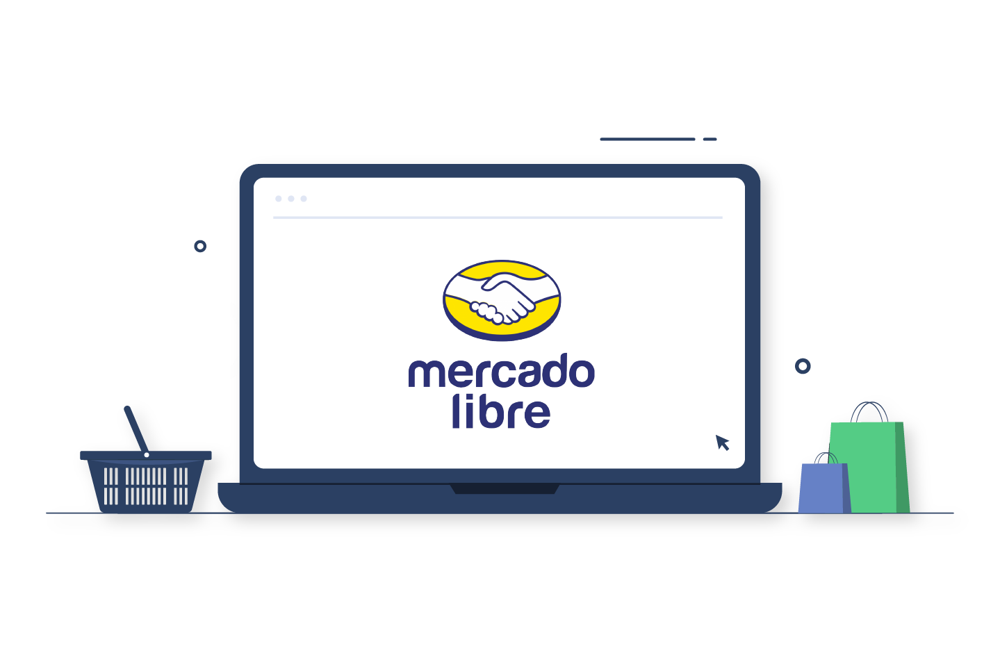

 MercadoLibre – Android App

[](https://github.com/angelicaLiliana/MercadoLibre/actions/workflows/android.yml)
[](https://opensource.org/licenses/MIT)

Este proyecto es una prueba técnica para MercadoLibre. Se desarrolló una aplicación Android en la que el usuario puede realizar búsquedas de productos por categoría y visualizar sus detalles.

---

## 🧩 Funcionalidades

- 🔍 Búsqueda por **categorías** disponibles.
- 📁 Visualización del **detalle de una categoría** seleccionada.

---


- [Kotlin](https://kotlinlang.org/)
- [Jetpack Compose](https://developer.android.com/jetpack/compose) – UI moderna y declarativa.
- [Retrofit](https://square.github.io/retrofit/) – Consumo de API REST.
- [Coroutines](https://kotlinlang.org/docs/coroutines-overview.html) – Tareas asíncronas.
- [ViewModel](https://developer.android.com/topic/libraries/architecture/viewmodel) – Gestión de estado.
- [JUnit](https://junit.org/) – Pruebas unitarias.
- [MockK](https://mockk.io/) – Simulación de dependencias en pruebas.

---

## ✅ Resultados de pruebas

> Las pruebas se ejecutan automáticamente mediante **GitHub Actions** en cada push o pull request.

### 📊 Cobertura de pruebas (resumen)

| Clase                          | Métodos probados | Estado |
|-------------------------------|------------------|--------|
| `SearchViewModel`             | ✅               | ✅     |
| `ServiceUseCase`              | ✅               | ✅     |
| `SearchCategoryItemUseCase`   | ✅               | ✅     |

_Visualiza los resultados completos en la pestaña [Actions](https://github.com/tu_usuario/tu_repo/actions) del repositorio._

_Reporte Pruebas Unitarias 📂(app/build/reports/tests/testDebugUnitTest/) al abrir el archivo .html en el navegador_

---


1. Clona el repositorio
   ```bash
   git clone https://github.com/ANGELICALILIANA/MercadoLibre.git

## 📂 Estructura del proyecto

```text
📦 app
┃
┣ 📂 data
┣ 📂 di
┣ 📂 domain
┣ 📂 navigation
┣ 📂 presentation
┣ 📂 ui
┗ 📄 AndroidManifest.xml

